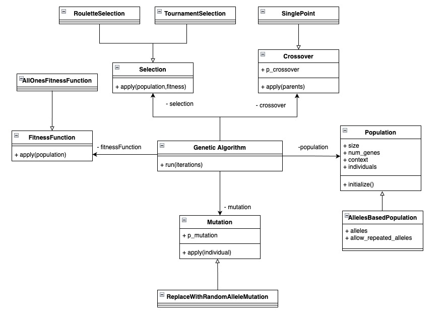

# Computación Evolutiva
    
Este framework ofrece la implementación de un algoritmo genetico ofreciendo los componentes necesarios para construir y entrenar un modelo capaz de resolver problemas de varios tipos.
 
## Diagrama de clases

A continuación se presenta el diagrama de clases correspondiente

